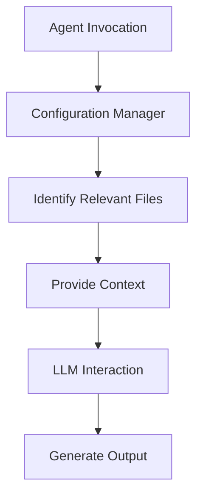

# Agent Communication

Agent communication is a critical aspect of the Meta Agentic AI System. It enables agents to collaborate and share information to achieve their goals.

## Communication Flow

1.  **Agent Invocation**: An agent is invoked with a specific task.
2.  **Configuration Manager**: The Configuration Manager agent is called to identify the relevant files for the task.
3.  **Context Provision**: The relevant files are provided as context to the invoked agent.
4.  **LLM Interaction**: The agent interacts with the LLM to perform the task.
5.  **Output Generation**: The agent generates an output in the specified format.

## Agent Communication Diagram

