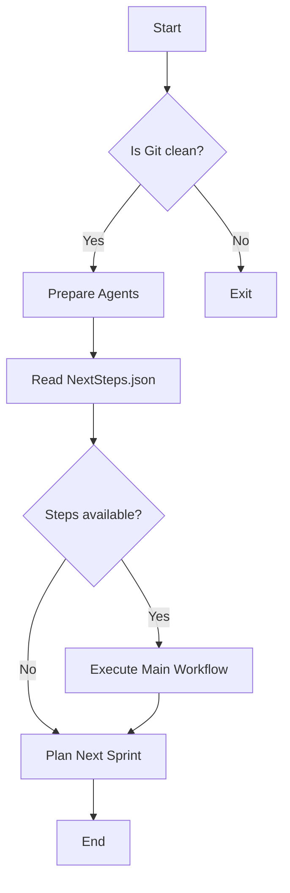

# Bootstrap Process

The bootstrap process is the initial phase of the system's execution. It sets up the environment and starts the main workflow.

## Steps

1.  **Verify Clean State**: Checks if the Git working directory is clean.
2.  **Prepare Agents**: Initializes the agents required for the workflow.
3.  **Determine Current Sprint Plan**: Reads the `NextSteps.json` file to determine the current state of the sprint.
4.  **Execute Main Workflow Loop**: Iterates through the steps of the sprint, executing the design, implementation, and verification phases.
5.  **Plan Next Sprint**: After the current sprint is completed, it plans the next sprint.

## Bootstrap Flow Diagram

