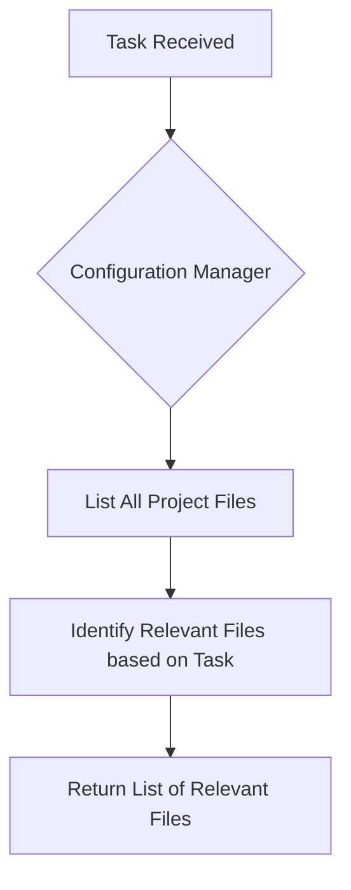

# Configuration Manager Agent

The Configuration Manager is a specialized agent responsible for providing the necessary context to other agents.

## Responsibilities

1.  **File Identification**: Identifies the relevant files for a given task.
2.  **Contextualization**: Provides the content of the relevant files to the requesting agent.
3.  **Efficiency**: Reduces the amount of information that needs to be processed by other agents.
4.  **Accuracy**: Ensures that the agents have the correct information to perform their tasks.
5.  **Decoupling**: Decouples the agents from the file system.

## Configuration Manager Flow Diagram

