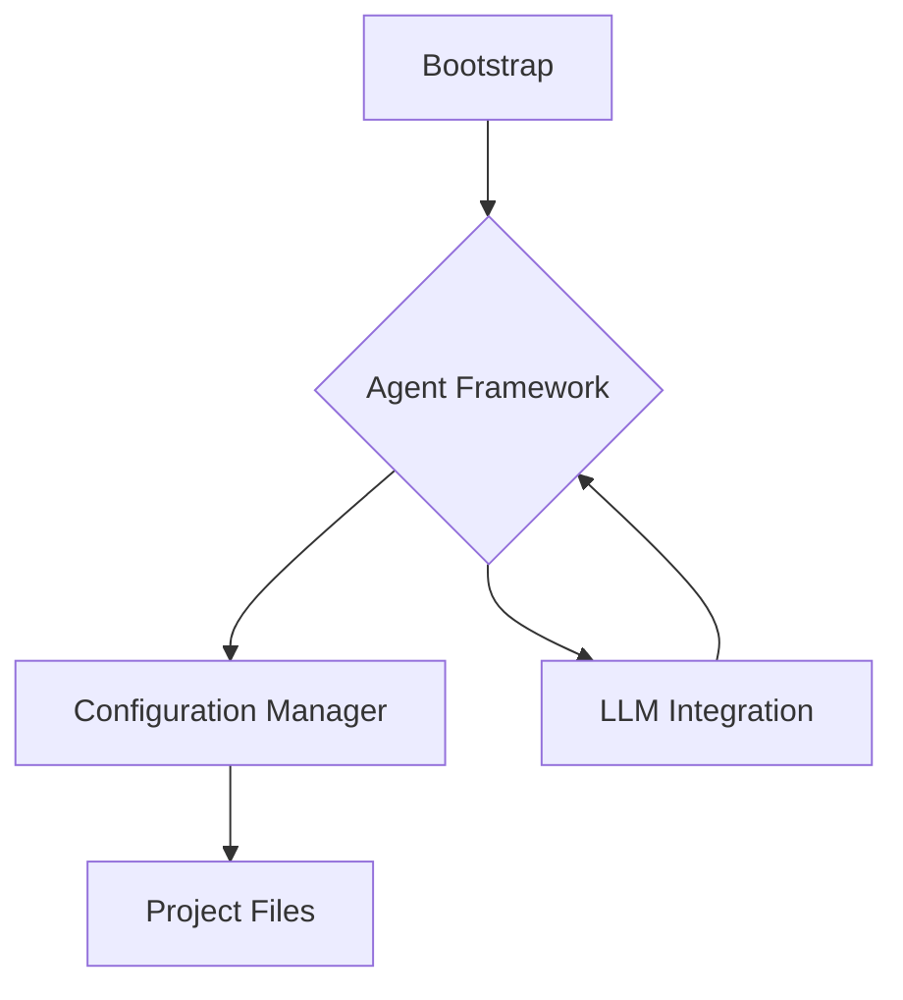

# System Architecture

This document provides a high-level overview of the Meta Agentic AI System's architecture.

## Core Components

The system is composed of the following core components:

1.  **Bootstrap**: The entry point of the system, responsible for initiating the workflow.
2.  **Agent Framework**: The set of agents that perform the tasks.
3.  **Configuration Manager**: A special agent that provides the context to other agents.
4.  **LLM Integration**: The connection to the Large Language Models.
5.  **Project Files**: The source code and other files of the project being developed.

## System Flow Diagram

