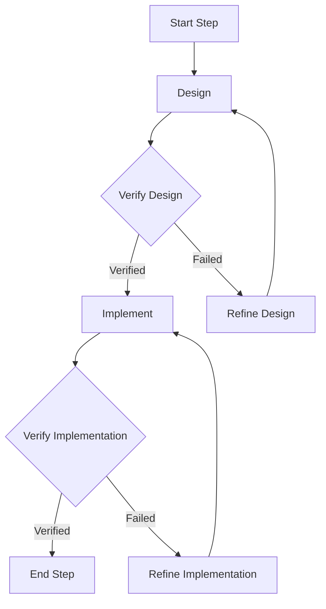

# Main Workflow

The main workflow of the Meta Agentic AI System is an iterative process of designing, implementing, and verifying software.

## Phases

1.  **Design**: The `DocWriter` agent creates a design document for the current task.
2.  **Design Verification**: The `Verifier` agent verifies the design document.
3.  **Implementation**: The `CodeGenerator` agent generates the code based on the design document.
4.  **Implementation Verification**: The `Verifier` agent verifies the generated code.
5.  **Refinement**: If any of the verification steps fail, the `CodeRefiner` agent is used to fix the issues.

## Workflow Diagram

